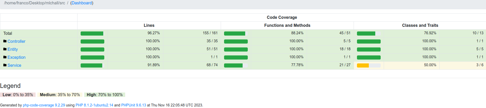
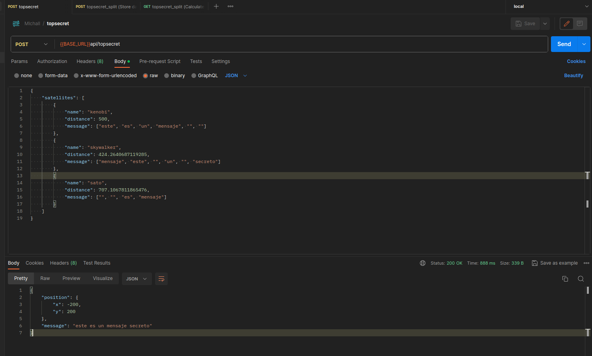

## Requirements
```
- PHP 8.1 or later
- Composer
- xdebug (to generate test html reports)
- Symfony CLI (used version 5.7.3)
```

## Installation
```sh
git clone https://github.com/francoPizzutti/mlchall.git

cd mlchall

cp .env.dist .env

cp .env.test.dist .env.test

composer install --no-cache
```


## Dev server: 
```sh
symfony server:start
```

## Run tests
- Note: For detailed test run report open ${PWD}/reports/index.html with Chrome.

```sh
composer phpunit
```

- Sample output from last run
```sh
$ composer phpunit

> XDEBUG_MODE=coverage php bin/phpunit
PHPUnit 9.6.13 by Sebastian Bergmann and contributors.

Runtime:       PHP 8.1.2-1ubuntu2.14 with Xdebug 3.1.2
Configuration: /home/franco/Desktop/mlchall2/phpunit.xml.dist

.............................                                     29 / 29 (100%)

Time: 00:01.012, Memory: 44.50 MB

OK (29 tests, 46 assertions)

Generating code coverage report in HTML format ... done [00:00.035]


Code Coverage Report Summary:
  Classes: 76.92% (10/13)    
  Methods: 88.24% (45/51)    
  Lines:   96.27% (155/161)  

```

- Last HTML coverage report



- Sample postman request



- Public URL (28 days available from last time I commited this): https://www.master-7rqtwti-ysy6yew4m5vgy.us.platformsh.site/  [DEAD]

## Technical debt

- Adding things like authentication and rate limit validation could be a good starting point for application improvement.
- Input validations could be a little bit more exhaustive to cover all cases.
- CacheService and cache configuration is a lot more improvable.
- Test cases do not contemplate ALL the possibilities. They also do not cover the 100% of application codebase.
- Dockerize the application and even add a docker-compose file if a database service is added to the architecture would be great.
